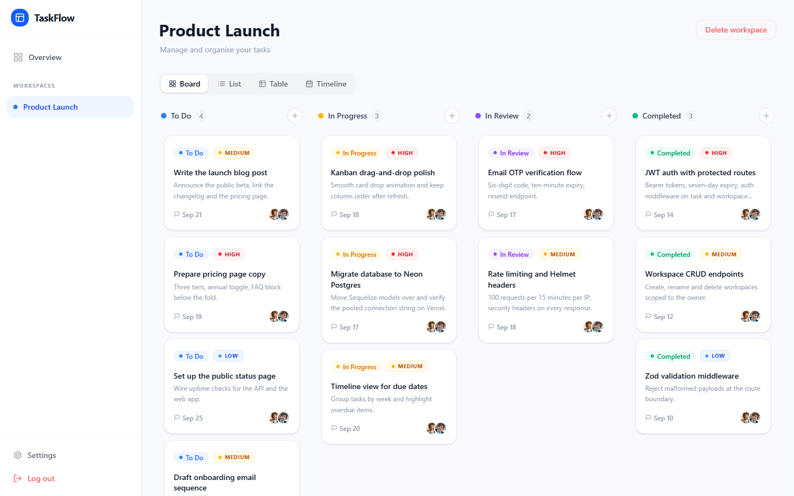

# ProductSpace Task Tracker

A production-ready mini SaaS for managing work across workspaces: a Next.js 16 (React 19) frontend, an Express + TypeScript REST API, Neon PostgreSQL through Sequelize, email-OTP sign-up with JWT sessions, and a drag-and-drop Kanban board with Board, List, Table and Timeline views. Built to match the ProductSpace Full Stack Developer Intern screening requirements.



## What it does

- **Accounts** - sign up with a name, email and password; a 6-digit OTP (valid for 10 minutes) is emailed to verify the address before the first sign-in. Passwords are hashed with bcrypt and sign-in returns a JWT that lasts 7 days.
- **Password reset** - forgot-password emails a reset link that is valid for one hour.
- **Workspaces** - create, rename and delete workspaces. Every row is owned by a user (`ownerId`) and every read and write is filtered by owner, so users only ever see their own data.
- **Tasks** - title, description, status (`todo`, `in-progress`, `in-review`, `completed`), priority (`low`, `medium`, `high`), due date and a position used for ordering.
- **Four views** - Board (Kanban with drag-and-drop between columns via dnd-kit), List, Table and Timeline. A drop is persisted through one batch endpoint inside a single database transaction.
- **Onboarding** - a new account gets a "Getting Started" workspace with sample tasks the moment its email is verified.
- **Settings** - update the display name or password.

## Stack

- Frontend: Next.js (React) + Tailwind, shadcn/ui components, dnd-kit for drag-and-drop
- Backend: Node.js + Express + TypeScript
- Database: **Neon PostgreSQL** via **Sequelize ORM**
- Auth: bcrypt password hashing + JWT
- Email: Nodemailer over SMTP for the OTP and password-reset mail
- Validation and hardening: Zod request validation, centralized error handler, Helmet, express-rate-limit (100 requests per 15 minutes per IP)
- Tests: Jest + Supertest against a Postgres test database, with email delivery mocked

## Architecture

```
app/                  Next.js App Router pages: landing, auth, workspaces, tasks, settings
components/           Sidebar, layout and shadcn/ui primitives
lib/api.ts            Typed fetch wrapper and token helpers
api/index.js          Vercel Function entry point: exports the compiled Express app
server/src
|-- controllers/      business logic
|-- middleware/       JWT auth, Zod validation, centralized error handling
|-- models/           Sequelize entities: User, Workspace, Task
|-- routes/           HTTP wiring only
|-- app.ts            Express app: Helmet, CORS, rate limit, idempotent DB init
`-- server.ts         local entry point (listens on PORT)
```

- The Express app performs an idempotent database initialization before the API routes, so the local `server.ts` and the Vercel Function share the same app instance safely.
- In production the frontend calls same-origin `/api/*` and `vercel.json` rewrites those requests to the Express function. Locally the frontend talks to `http://localhost:5000` through `NEXT_PUBLIC_API_BASE_URL`.
- Task tenancy is enforced by `ownerId` checks in every task query; JWT Bearer auth protects the task and workspace endpoints.
- More detail: [docs/architecture.md](docs/architecture.md), [docs/implementation.md](docs/implementation.md) and [docs/screening-requirements-comparison.md](docs/screening-requirements-comparison.md).

## Requirement mapping

- Signup/Login: `/api/auth/signup`, `/api/auth/login`
- Password hashing: Sequelize `User` hooks with bcrypt
- JWT auth + protected routes: `authMiddleware`
- OTP verification: `/api/auth/verify-email`, `/api/auth/resend-otp`
- Multi-user workspaces/tasks: rows owned by `ownerId`; all reads/writes filtered by owner
- Kanban tasks: `todo`, `in-progress`, `in-review`, `completed`, plus priority, due date, and position
- Validation: Zod-based `validate` middleware
- Error handling: centralized `errorHandler`
- DB schema: PostgreSQL tables for users, tasks, workspaces

## API overview

All endpoints speak JSON. Routes marked **JWT** require an `Authorization: Bearer <token>` header.

| Method | Route | Auth | Purpose |
| --- | --- | --- | --- |
| POST | `/api/auth/signup` | - | Create an account and email the OTP |
| POST | `/api/auth/login` | - | Sign in (verified accounts only); returns the JWT |
| POST | `/api/auth/verify-email` | - | Verify the OTP; returns the JWT and seeds the starter workspace |
| POST | `/api/auth/resend-otp` | - | Send a fresh OTP |
| POST | `/api/auth/forgot-password` | - | Email a password-reset link |
| POST | `/api/auth/reset-password` | - | Set a new password with the reset token |
| PUT | `/api/auth/profile` | JWT | Update name or password |
| GET, POST | `/api/workspaces` | JWT | List or create workspaces |
| GET, PUT, DELETE | `/api/workspaces/:id` | JWT | Read, rename or delete a workspace (deleting removes its tasks) |
| POST | `/api/workspaces/demo` | JWT | Create a sample workspace with tasks |
| GET | `/api/tasks?workspaceId=` | JWT | List tasks, ordered by status and position |
| POST | `/api/tasks` | JWT | Create a task |
| PUT | `/api/tasks/batch` | JWT | Move or reorder several tasks in one transaction |
| PUT, DELETE | `/api/tasks/:id` | JWT | Update or delete a task |
| GET | `/api/health` | - | Liveness check |

## Run locally

Prerequisites: Node.js 24, a PostgreSQL database (a free Neon project works, but any Postgres URL does) and an SMTP account for the OTP and reset emails (Gmail with an app password is the default).

```bash
git clone https://github.com/GODOSTROYER/task-tracker.git
cd task-tracker

# backend
cd server
npm install
cp .env.example .env        # fill in DATABASE_URL, JWT_SECRET and the SMTP_* values
npm run dev                 # API on http://localhost:5000; Sequelize creates the tables on first boot

# in root
npm install
cp .env.example .env.local  # NEXT_PUBLIC_API_BASE_URL=http://localhost:5000
npm run dev                 # UI on http://localhost:3000
```

Tests: `cd server && npm test` (uses `DATABASE_URL_TEST` when it is set, otherwise `DATABASE_URL`).

## Environment variables

### Local backend (`server/.env`)

- `PORT=5000`
- `DATABASE_URL=postgresql://<user>:<password>@<host>/<db>?sslmode=require`
- `JWT_SECRET=<strong-secret>`
- `SMTP_HOST=smtp.gmail.com`
- `SMTP_PORT=587`
- `SMTP_USER=<smtp-user>`
- `SMTP_PASS=<smtp-password>`
- `FROM_EMAIL=<verified-sender>`
- `FROM_NAME=Task Tracker`
- `FRONTEND_URL=http://localhost:3000`

`DATABASE_URL_TEST` is optional and only used by the test suite. See [server/.env.example](server/.env.example).

### Frontend (`.env.local`)

- `NEXT_PUBLIC_API_BASE_URL=http://localhost:5000`

In Vercel production, leave `NEXT_PUBLIC_API_BASE_URL` unset so the app uses same-origin `/api`. See [.env.example](.env.example).

## Neon setup

1. Create a Neon project/database.
2. Copy the pooled connection string to `DATABASE_URL`.
3. Start the backend; Sequelize auto-syncs the tables on boot.

## Vercel deployment

- Root project: `task-tracker`
- Project name: `productspace-task-tracker`
- Build command: `npm --prefix server run build && npm run build`
- Install command: `npm install && npm --prefix server install`
- Add the backend variables above (`DATABASE_URL`, `JWT_SECRET`, `SMTP_*`, `FROM_*`, `FRONTEND_URL`) as Production environment variables and leave `NEXT_PUBLIC_API_BASE_URL` unset.
- [vercel.json](vercel.json) sets both commands, rewrites `/api/(.*)` to the `api/index.js` function and gives it a 30-second maximum duration.

## Limitations

- Workspaces are single-owner; there is no sharing or collaboration between accounts.
- Sign-in requires a verified email, so a working SMTP account is mandatory and there is no demo login.
- The schema is created with Sequelize `sync()` on boot rather than versioned migrations.
- Rate limiting is in-memory, so on Vercel it applies per function instance rather than globally.
- The JWT lives in `localStorage` for 7 days; there are no refresh tokens or server-side revocation.

## Author

**Arnav Bule** - [arnavbule.in](https://www.arnavbule.in) | [github.com/GODOSTROYER](https://github.com/GODOSTROYER)
