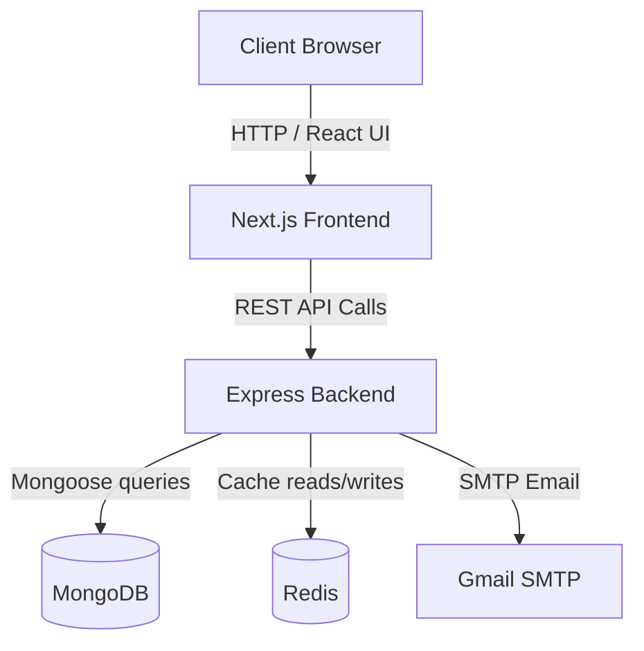
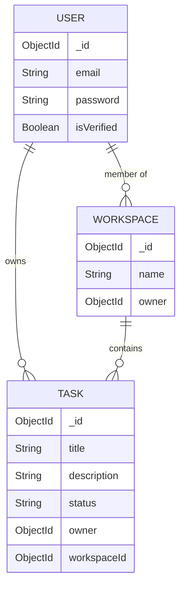
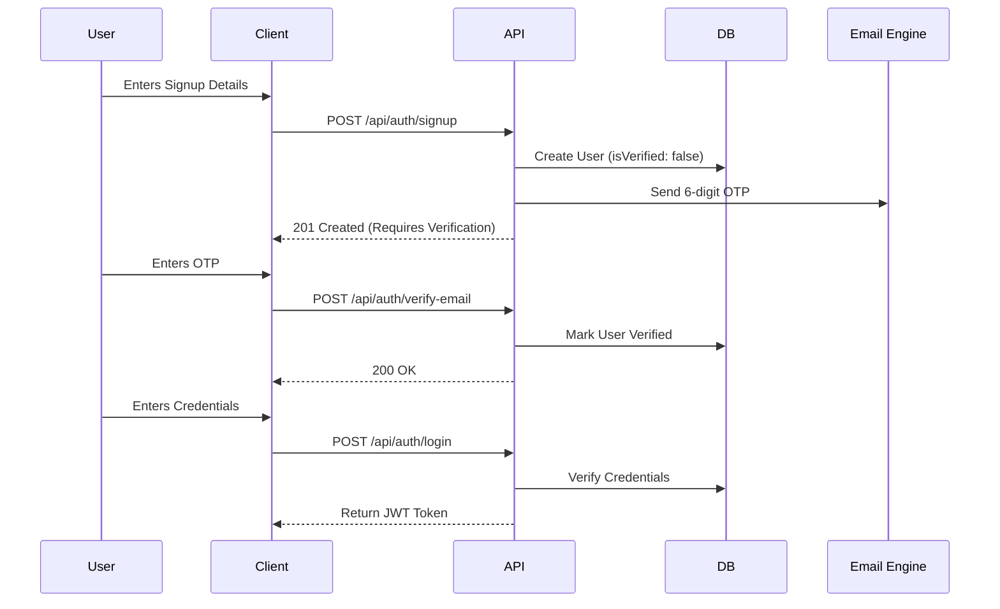
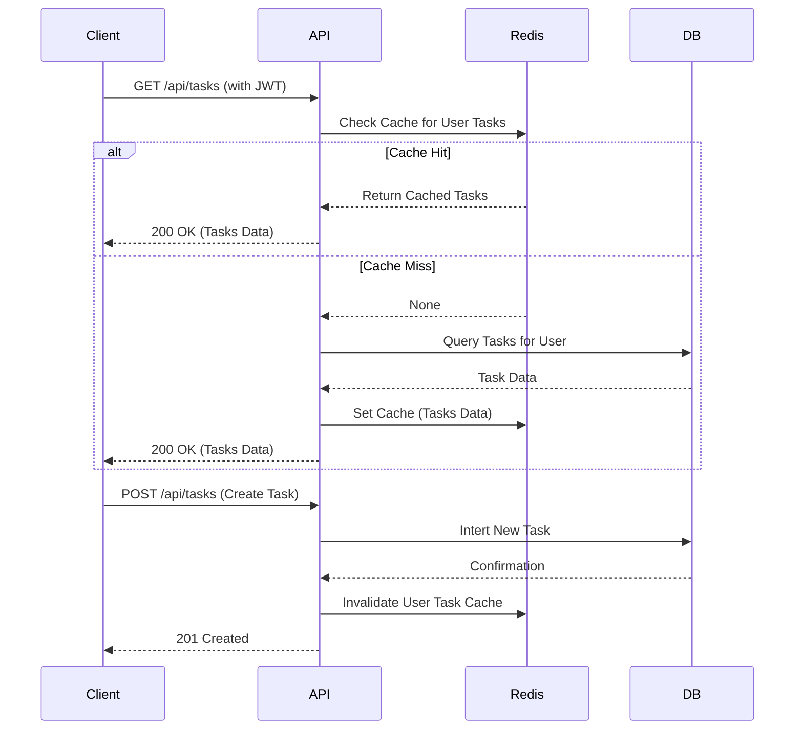

# System Architecture

This document outlines the high-level architecture, data flow, and core models of the Mini Task Tracker application.

## Overview

The application follows a decoupled client-server architecture:

- **Frontend**: A Next.js 15 application utilizing React 19 and the App Router.
- **Backend**: A Node.js Express server providing a RESTful API.
- **Database**: MongoDB for persistent data storage using Mongoose ODM.
- **Cache**: Redis for caching API responses and improving read performance.

## System Architecture Diagram

## Data Models

The system relies on three primary data models:

1. **User**: Stores authentication details, hashed passwords, and email verification status.
2. **Task**: Represents an individual task item with properties like title, status, and ownership references.
3. **Workspace**: A grouping concept (optional based on schema) allowing tasks to be organized into distinct project spaces.

### Database Schema Relationships

## Authentication Flow

The application uses an asynchronous JWT-based authentication flow with email verification.

## Task Management Flow (with Caching)

To optimize performance, task fetching is heavily reliant on Redis.

