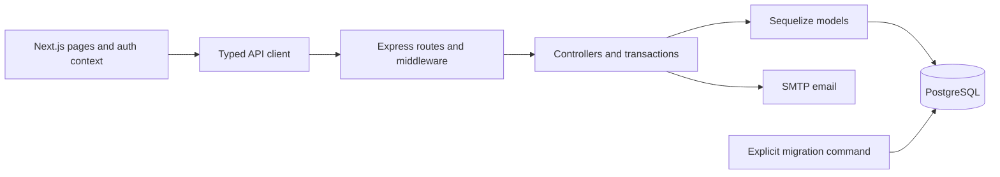

# Architecture

```mermaid
flowchart LR
  UI[Next.js pages and auth context] --> Fetch[Typed API client]
  Fetch --> API[Express routes and middleware]
  API --> Logic[Controllers and transactions]
  Logic --> ORM[Sequelize models]
  ORM --> DB[(PostgreSQL)]
  Logic --> SMTP[SMTP email]
  CLI[Explicit migration command] --> DB
```

## Runtime and deployment

`app/` contains the Next.js 16 / React 19 frontend. `/workspaces` lists workspaces and `/workspaces/[id]` hosts task views; `/tasks` redirects to the workspace list. Authentication pages and `/settings` share the auth context and API wrapper.

`server/src/app.ts` defines the Express application. `server/src/server.ts` starts it locally; `api/index.js` exports the compiled app for Vercel. In deployment, `/api/*` is rewritten to that function. Local development uses `NEXT_PUBLIC_API_BASE_URL=http://localhost:5000`.

Connection initialization is shared and retries after failure. It authenticates the connection without changing the schema. `/api/health` checks process liveness; `/api/ready` checks database connectivity and the required migration marker/column. Run the explicit migration before deploying code that needs the new schema.

## Request and data boundaries

- Routes validate request bodies, path IDs and queries with Zod and forward async errors to the centralized handler.
- Auth middleware verifies HS256 JWTs, loads the user, requires email verification, and compares the token version with a keyed digest of the current password hash.
- Controllers scope task/workspace operations to `ownerId`; referenced workspaces must also belong to the user.
- PostgreSQL holds users, workspaces and tasks with foreign keys and ownership/order indexes. Batch changes are atomic; workspace and task locks coordinate concurrent updates. The drag endpoint applies a relative move against current server ordering and returns the updated workspace tasks, avoiding stale full-workspace client snapshots.
- Email contains raw OTP/reset challenges, but only keyed hashes are persisted. Verification and challenge changes use row locks and transactions.

The frontend validates a stored session with `GET /api/auth/me`, rechecks on focus/storage/session changes and handles expiry. Password changes return a replacement token; older sessions fail subsequent API authentication.

## Schema lifecycle

`server/src/database/migrate.ts` runs forward-only additive SQL in a transaction under a PostgreSQL advisory lock. It creates missing baseline tables/types, adds the attempt counter and indexes, and records the baseline in `schema_migrations`. Existing application rows are retained; the integration suite tests adoption and repeatability on a disposable database. It is not a general repair tool for arbitrarily divergent schemas.

No request, cold start or application build performs schema synchronization. Before releasing, set the intended `DATABASE_URL`, run `npm run build:server`, then `npm run db:migrate`, and require `npm run db:check` to pass. The check is read-only; preview builds must not run production migrations. See the [README](../README.md) for installation, migration sequencing, test safeguards and the authentication upgrade compatibility note.
